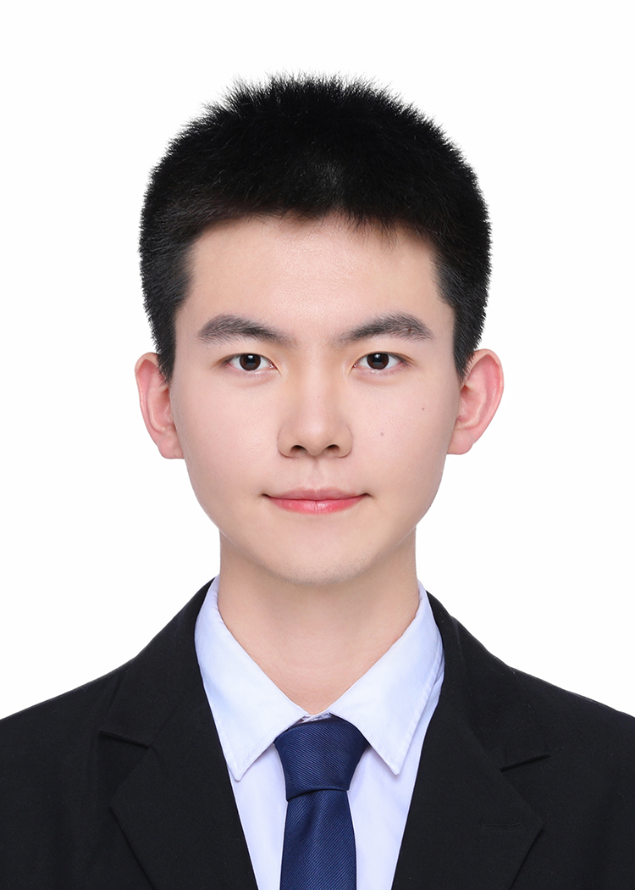

::: {.columns}
::: {.column width="35%"}
{fig-alt="Profile photo of Jiayuan Guo" width=180}
:::

::: {.column width="65%"}
## About Me

I am currently a second-year master's student. My research interests focus on agent memory and long-context processing. I am advised by Prof. Xueqi Cheng. Feel free to contact me.
:::
:::

## CV

### Education

#### Institute of Computing Technology, Chinese Academy of Sciences
Master Degree | 2024 - Present  
Advisor: Prof. Xueqi Cheng

#### Beijing Jiaotong University
Bachelor Degree | 2020 - 2024  
Institute: Institute of Network Science and Intelligent Systems  
Advisor: Prof. Huaiyu Wan

##### Honors and Awards 

- Zhijin Scholarship
- First Class Academic Excellence Scholarship
- Finest Award, Mathematical Contest in Modeling (MCM), USA
- Outstanding Graduate of Beijing Jiaotong University

